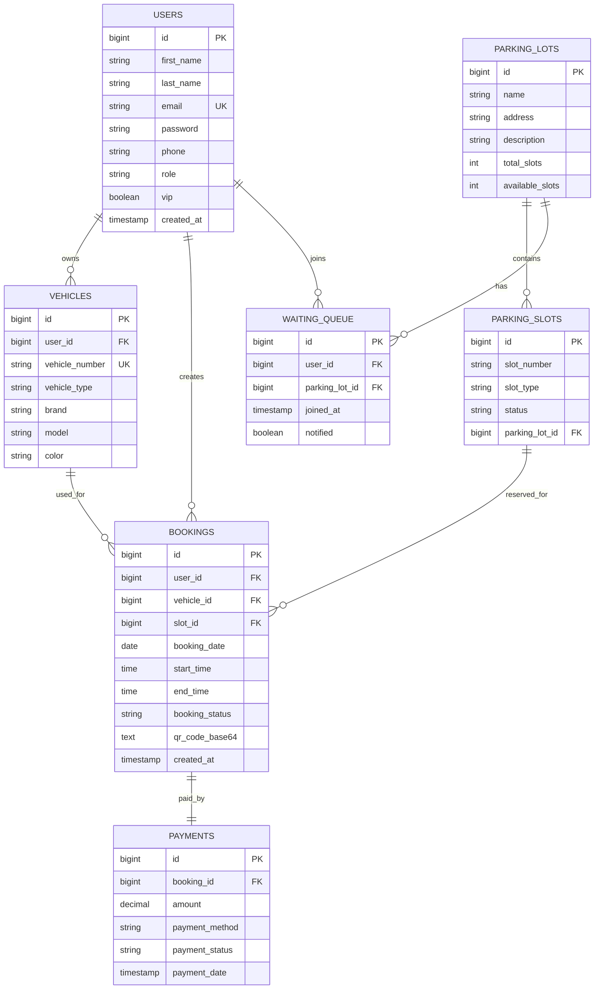

# ParkSmart AI Entity Relationship Diagram

```mermaid
erDiagram
    USERS ||--o{ VEHICLES : owns
    USERS ||--o{ BOOKINGS : creates
    USERS ||--o{ WAITING_QUEUE : joins
    PARKING_LOTS ||--o{ PARKING_SLOTS : contains
    PARKING_LOTS ||--o{ WAITING_QUEUE : has
    PARKING_SLOTS ||--o{ BOOKINGS : reserved_for
    VEHICLES ||--o{ BOOKINGS : used_for
    BOOKINGS ||--|| PAYMENTS : paid_by

    USERS {
      bigint id PK
      string first_name
      string last_name
      string email UK
      string password
      string phone
      string role
      boolean vip
      timestamp created_at
    }
    VEHICLES {
      bigint id PK
      bigint user_id FK
      string vehicle_number UK
      string vehicle_type
      string brand
      string model
      string color
    }
    PARKING_LOTS {
      bigint id PK
      string name
      string address
      string description
      int total_slots
      int available_slots
    }
    PARKING_SLOTS {
      bigint id PK
      string slot_number
      string slot_type
      string status
      bigint parking_lot_id FK
    }
    BOOKINGS {
      bigint id PK
      bigint user_id FK
      bigint vehicle_id FK
      bigint slot_id FK
      date booking_date
      time start_time
      time end_time
      string booking_status
      text qr_code_base64
      timestamp created_at
    }
    PAYMENTS {
      bigint id PK
      bigint booking_id FK
      decimal amount
      string payment_method
      string payment_status
      timestamp payment_date
    }
    WAITING_QUEUE {
      bigint id PK
      bigint user_id FK
      bigint parking_lot_id FK
      timestamp joined_at
      boolean notified
    }
```
